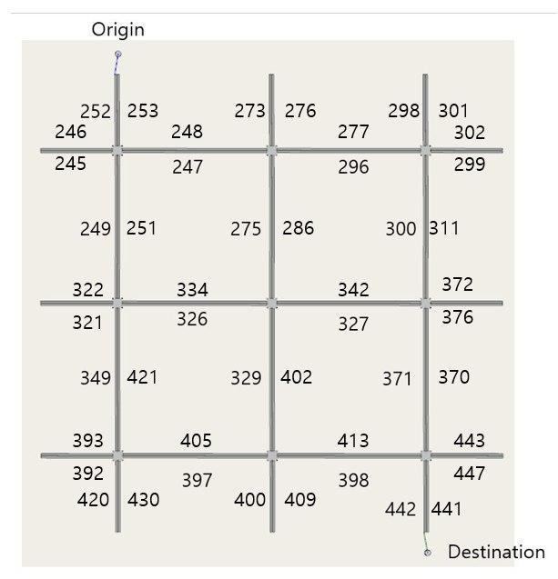

# TrajGAIL

### Introduction
Generative model for urban vehicle trajectories based on Deep Learning 
This repository include implementations of :
 - Markov Mobility Chain Model for next location prediction (Gambs et al. 2012)
 - RNN based trajectory generator (Choi et al. 2018) 
 - MaxEnt inverse reinforcement learning (Ziebart et al. 2008)
 - TrajGAIL based on Generative Adversarial Imitation Learning (Ho et al. 2016, Choi et al. 2020)
 - ShortestPath World (MDP for routing imitations)

### Citations
If you use this code for your research, please cite our paper.

```bash
@article{choi2021trajgail,
  title={TrajGAIL: Generating urban vehicle trajectories using generative adversarial imitation learning},
  author={Choi, Seongjin and Kim, Jiwon and Yeo, Hwasoo},
  journal={Transportation Research Part C: Emerging Technologies},
  volume={128},
  pages={103091},
  year={2021},
  publisher={Elsevier}
}
```

### Data availability
Due to the public availability issue of taxi data of Gangnam District, it is not possible to upload the taxi data. 

The available data is a virtual vehicle trajectory data generated by AIMSUN shortest path routing engine.

Below figure shows the network configuration.




### Requirements
python>3.7

required python packages in requirement.txt

<Bash terminal>
 
```bash
pip install -r requirement.txt
```


### How to Run

<Bash terminal>

To run Behavior Cloning MMC Test

```bash
python scripts/behavior_clone/run_bc_rnn.py
```

To run Behavior Cloning RNN Test

```bash
python scripts/behavior_clone/run_bc_rnn.py
```


To run MaxEnt IRL

```bash
python scripts/irl/demo_shortestpath.py
```


To run TrajGAIL

```bash
python scripts/gail/run_gail.py
```

